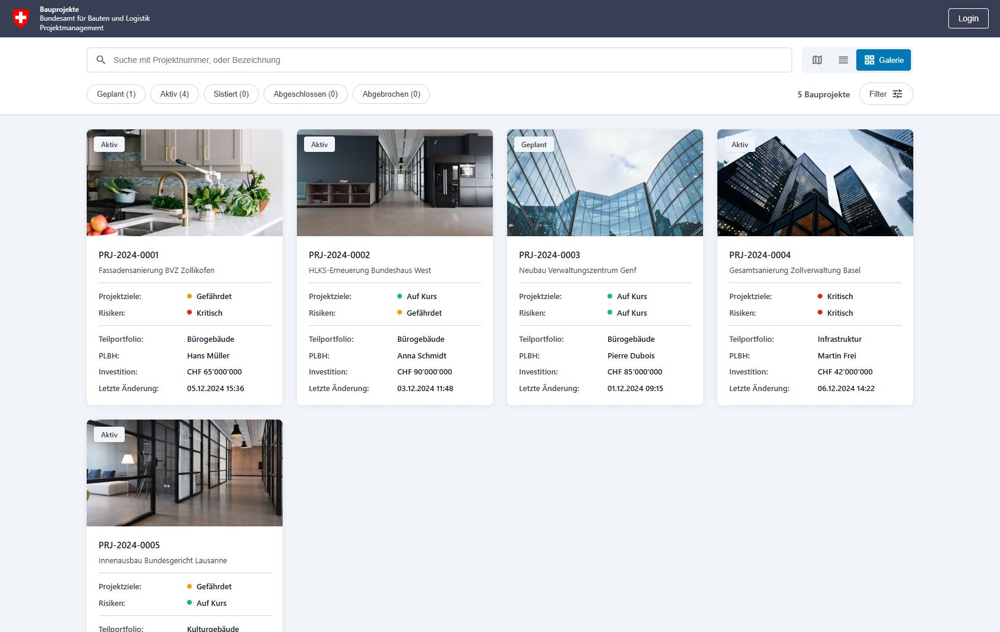
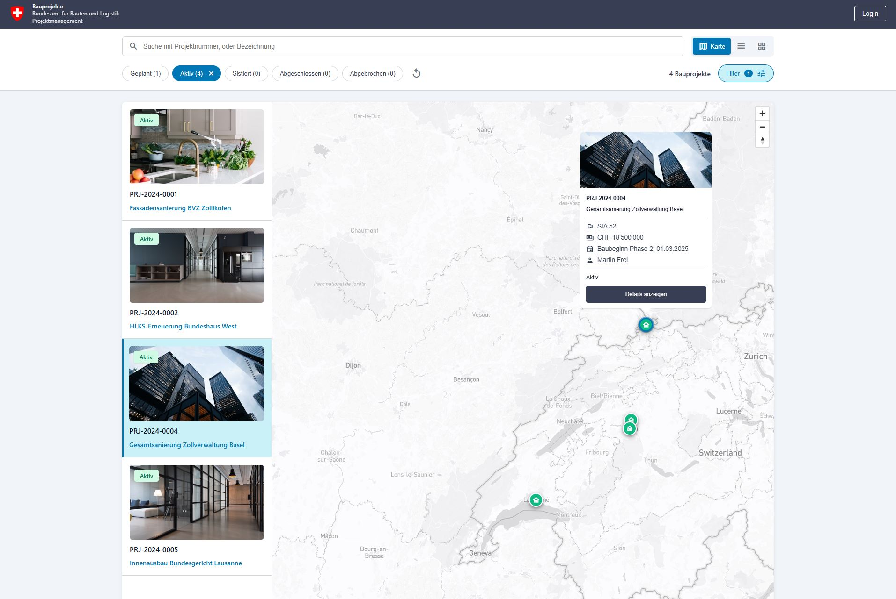
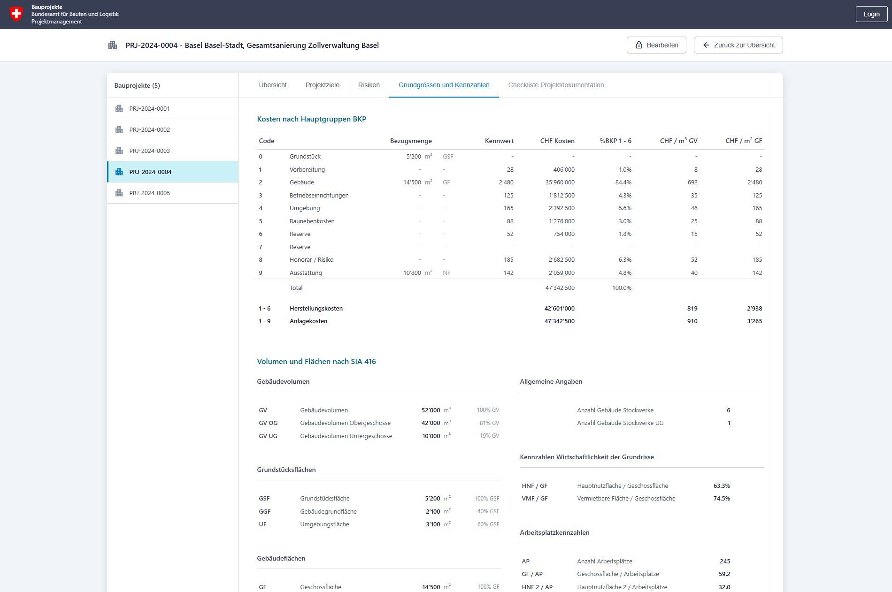

# PM-Cockpit

A web-based project management dashboard for Swiss federal construction projects, developed for the Bundesamt für Bauten und Logistik (BBL). This platform enables visualization, filtering, and management of building projects across Switzerland.

- Deployed: [davras5.github.io/pm-cockpit/](https://davras5.github.io/pm-cockpit/)

<p align="center">
  
</p>

<p align="center">
  
  
</p>

## Features

- **Three View Modes**: Gallery grid, sortable list table, and interactive Mapbox map
- **Advanced Filtering**: Multi-criteria filtering by status, SIA phase, management area, sub-portfolio, and more
- **Project Details**: Comprehensive information including location, budget, project manager, construction type, and embedded maps
- **Real-time Search**: Instant text search across project names, numbers, cities, and project managers
- **URL State Persistence**: Shareable filtered views via URL parameters
- **Swiss Standards**: SIA phases (11-61), CHF currency formatting, de-CH locale

## Tech Stack

- **Frontend**: Vanilla HTML5, CSS3, JavaScript (ES6+)
- **Mapping**: Mapbox GL JS v3.0.1
- **Icons**: Material Design Icons
- **Data**: JSON with normalized building-project relationships

Zero dependencies - no build process required.

## Getting Started

1. Clone the repository:
   ```bash
   git clone https://github.com/davras5/pm-cockpit.git
   cd pm-cockpit
   ```

2. Serve the files using any static file server:
   ```bash
   # Using Python
   python -m http.server 8000

   # Using Node.js (npx)
   npx serve
   ```

3. Open `http://localhost:8000` in your browser

## Project Structure

```
pm-cockpit/
├── index.html        # Complete SPA (HTML, CSS, JS embedded)
├── data.json         # Project and building data with metadata
├── images/
│   └── ch.png        # Swiss coat of arms
└── README.md
```

## License

Licensed under [MIT](https://opensource.org/licenses/MIT)

---
*This is an unofficial mockup for demonstration purposes.*
